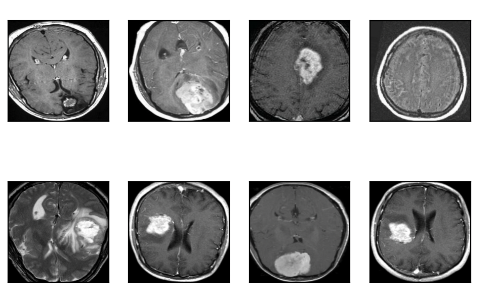
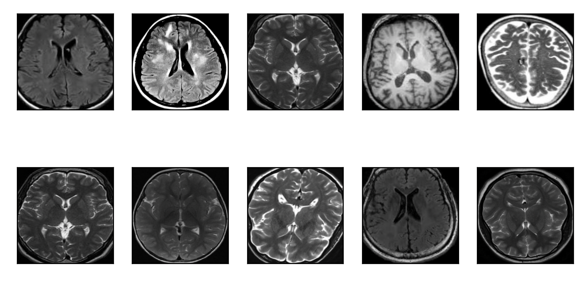
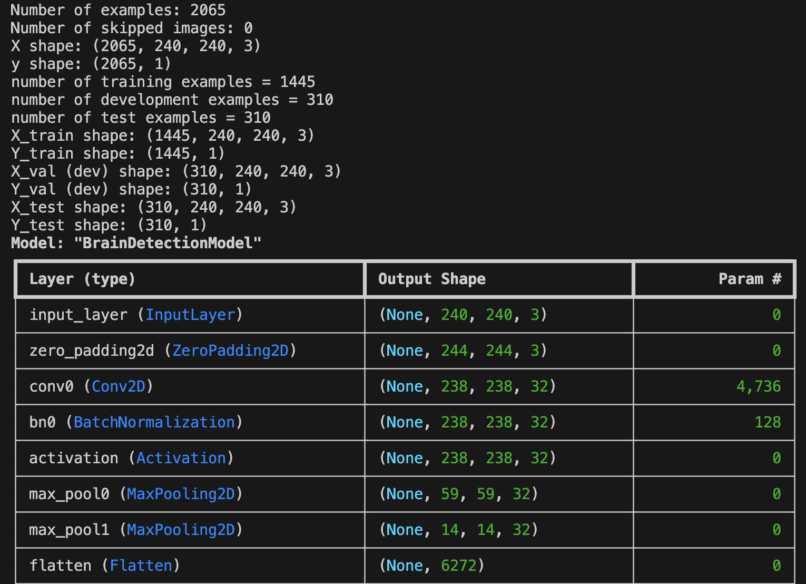

# NeuralSense: Brain Tumor Detection Software using Convolutional Neural Networks (CNN)

## Overview

NeuralSense is a deep learning-based solution for the detection of brain tumors using Convolutional Neural Networks (CNNs). The model is trained to classify brain MRI images into two categories: 'tumor' and 'non-tumor'. By leveraging a custom neural network architecture, the system performs image preprocessing, data augmentation, and evaluation of performance metrics such as accuracy, precision, recall, F1 score, and ROC AUC.

The trained model not only classifies MRI images but also moves the correctly classified images into corresponding folders, enabling clear analysis and visualization of the classification results.

## Features

- **Image Preprocessing**: Cropping brain contours from MRI images to focus on the tumor regions for enhanced classification accuracy.

  

  

- **Model Architecture**: A CNN-based neural network designed to accurately classify images as 'tumor' or 'non-tumor'.
- **Data Augmentation**: Utilizes augmented data to improve model robustness and generalization.
- **Performance Metrics**: Tracks and logs performance metrics including accuracy, precision, recall, F1 score, and ROC AUC to evaluate model performance.
- **Model Checkpoints & TensorBoard**: Monitors the model's training progress and saves the best-performing model for future use.
- **Image Classification & Sorting**: The system classifies MRI images and sorts them into directories based on their predicted labels for 'tumor' or 'non-tumor'.

## License

Copyright (c) 2025 Turc Raul

All rights reserved. This project is for educational purposes only and may not be reused or redistributed without explicit permission.
